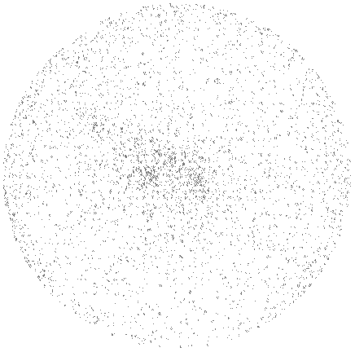
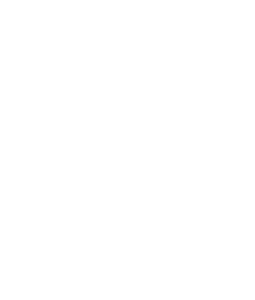
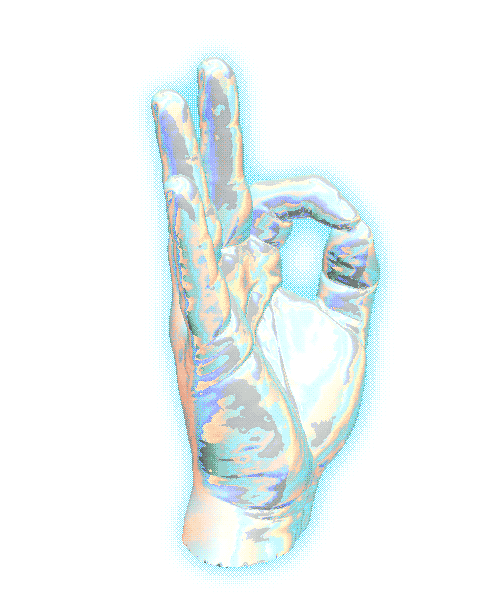

    
    
    

# 𝙷𝚒 𝙸'𝚖 𝚅𝚒𝚔𝚊𝚜𝚑 

### 𝙵𝚞𝚕𝚕-𝚂𝚝𝚊𝚌𝚔 | 𝙲𝚛𝚎𝚊𝚝𝚒𝚟𝚎 𝙳𝚎𝚟𝚎𝚕𝚘𝚙𝚎𝚛 | 𝙿𝚊𝚜𝚜𝚒𝚘𝚗𝚊𝚝𝚎 𝚊𝚋𝚘𝚞𝚝 𝙳𝚊𝚝𝚊 𝚂𝚌𝚒𝚎𝚗𝚌𝚎

or so I'd like to think 😂

Trying to simultaneously learn heaps and cook up cool projects.

#

 

    
    
    

<!-- GitHub Skyline image: https://skyline.github.com/vikichand/2021.png -->

    
    

### Follow Me:

    
    
    
    
    

<!-- TODO: Add latest work link - Vikash -->

-   💎 Currently trying to find time to learn more and work on
    -   Full-Stack
        -   Machine Learning
        -   AI
        -   JavaScript
        -   Python
        -   and Flutter projects
    -   and contribute more to open source, so stay tuned!
-   ⚡ Fun facts:
    -   I play games and try going to the GYM often 🤭
    -   I like my beers cold 🍺 and the whiskey old 🥃

### Top Tools & Technologies:

<!-- TODO: Update the rest of the as badges as below - Vikash -->

    
    
    
    
    
    

<!--

-->

    

#

### 𝙼𝚘𝚛𝚎 𝚊𝚋𝚘𝚞𝚝 𝚖𝚎:

    

    Languages and Tools I follow
    

     
    

        <a href="#">
            <!--  -->
            
        </a>
          
        Programming Languages 
        
        
        
        
        
          
        Frontend Development 
        
        
        
        
        
        
        
        
        
        
          
        Backend Development 
        
        
        
        
          
        Mobile Development 
        
        
        
          
        Static Site Generators 
        
        
        
          
        Frameworks 
        
        
        
          
        Databases 
        
        
        
        
        
        
          
        ML/AI 
        
        
          
        Data Visualization 
        
        
          
        Automation & Testing 
        
          
        DevOps 
        
        
        
        
        
          
        Backend as a Service(BaaS) 
        
        
        
          
        Game Engines 
        
        
          
        Others 
        
        
        
          
        Softwares 
        
        
        
        
        
        
        
        
        
        
    

_Profile stats_

<!--

-->

#

### ➜ Bizness

-   📑 [My Resume / CV](./resume/VikashChand_resume.pdf)  _updated [15/05/2022]_

    
    
    

_Latest 5 from a playlist I'm currently listening to for those late night coding sessions_

<!-- YouTube:START -->
- [far away - lofi hip hop type beat [FREE FOR PROFIT USE]](https://www.youtube.com/watch?v=b4Oe83aB8Fo)
- [lost - lofi hip hop type beat [FREE FOR PROFIT USE]](https://www.youtube.com/watch?v=0BcYVfvRBNQ)
- [Lost Summer - Post Malone/Travis Scott Type Beat &lpar;FREE FOR PROFIT USE&rpar;](https://www.youtube.com/watch?v=lchn3T2aYzU)
- [Possessed - dark rap/hip hop beat &lpar;FREE FOR PROFIT USE&rpar;](https://www.youtube.com/watch?v=PuWdyQvwsBk)
- [manic - alt rock type rap beat / Prod. Riddiman x Joe Leytrick &lpar;FREE FOR PROFIT USE&rpar;](https://www.youtube.com/watch?v=3I3DonXtEqA)
<!-- YouTube:END -->

_Stay focused!_

<!--

-->
