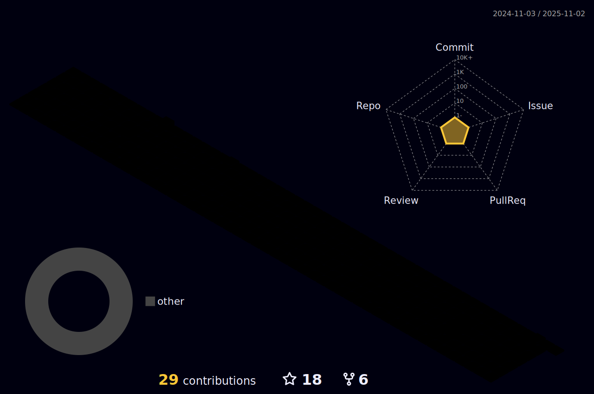

    
    
    

# 𝙷𝚒, 𝙸'𝚖 𝚅𝚒𝚔𝚊𝚜𝚑 

### 𝙵𝚞𝚕𝚕-𝚂𝚝𝚊𝚌𝚔 𝙲𝚛𝚎𝚊𝚝𝚒𝚟𝚎 𝚂𝚘𝚏𝚝𝚠𝚊𝚛𝚎 𝙴𝚗𝚐𝚒𝚗𝚎𝚎𝚛 | 𝙿𝚊𝚜𝚜𝚒𝚘𝚗𝚊𝚝𝚎 𝚊𝚋𝚘𝚞𝚝 𝙼𝚊𝚌𝚑𝚒𝚗𝚎 𝙻𝚎𝚊𝚛𝚗𝚒𝚗𝚐, 𝙰𝙸, 𝚊𝚗𝚍 𝙲𝚛𝚎𝚊𝚝𝚒𝚟𝚎 𝙲𝚘𝚍𝚒𝚗𝚐.

 Trying to simultaneously learn heaps and cook up cool projects.

#

 

    
    
    

<!-- GitHub Skyline image: https://skyline.github.com/vikichand/2021.png -->

<!--

    
    

-->

    
     
    

###  𝙵𝚘𝚕𝚕𝚘𝚠 𝙼𝚎:

    
    
    
    

<!-- TODO: Add latest work link - Vikash -->

Not your typical nerd 🧠😈

I quite passionately introduce myself as a Full-Stack Creative Software Engineer, passionate about Machine Learning, AI, and Creative Coding, with an enthusiastic student-minded eagerness.

I enjoy having the freedom of exploring and learning new technologies, which allows me the advantage of a T-Shaped skill set.

To give a little background, I've been diving headfirst into the tech industry for over 10 years, and while my keyboard has thankfully stayed clean, my hands have gotten quite dirty learning, exploring, and engineering cool stuff prizing the agility of a T-shaped skill set.

But professionally, a dynamic Full-Stack Creative Software Engineer boasting over 7 years of comprehensive hands-on experience in architecting, developing, and deploying enterprise-level applications across various platforms and industries. I've spearheaded solution design initiatives, significantly contributing to revenue growth, driving user engagement, and optimizing software performance. My expertise encompasses crafting state-of-the-art interactive UIs, integrating advanced Machine Learning and AI algorithms, enhancing user experiences, and streamlining delivery times. I've adeptly managed cross-functional teams in both on-site and remote environments, emphasizing CI/CD processes and rigorous testing protocols to consistently exceed business objectives.

Proficient in a broad tech stack including but not limited to:

    🥷
    - JavaScript | Python | React | Next.js | Flask | AWS | Angular | TypeScript | React Native | Flutter | NodeJS |
      Express | Redux | jQuery | PHP | GSAP | Three.js | WebGL | C# | .NET | C++ | SQL | Postgres | Firebase | Superbase |
      MongoDB | GitHub | Vercel | CI/CD | Terraform | Web3
    - UI/UX Design | Adobe XD | Adobe Photoshop | Figma | Unity | Unreal Engine | Game Development | FL Studio |
      Music Production

Brian Herbert once said, "The capacity to learn is a gift; the ability to learn is a skill; the willingness to learn is a choice." I couldn't agree more.

#learneveryday

-   💎 Currently trying to find time to learn more and work on
    -   Full-Stack
        -   Creative Software Engineering
        -   Machine Learning
        -   AI
        -   and Creative Coding projects
    -   and contribute more to open source, so stay tuned!
-   ⚡ Fun facts:
    -   I like my beers cold 🍺 and the whiskey old 🥃

###  𝚃𝚘𝚙 𝚃𝚘𝚘𝚕𝚜 & 𝚃𝚎𝚌𝚑𝚗𝚘𝚕𝚘𝚐𝚒𝚎𝚜:

<!-- TODO: Update the rest of the as badges as below - Vikash -->

    
    
    
    <!--  -->
    
    

<!--

-->

    

#

###  𝙼𝚘𝚛𝚎 𝚊𝚋𝚘𝚞𝚝 𝚖𝚎:

    

    Languages and Tools I follow
    

     
    

        <a href="#">
            <!--  -->
            
        </a>
          
        Programming Languages 
        
        
        
        
        
        
        
        
          
        Web Development 
        
        
        
        
        
        
        
        
        
        
        
         
        
        
        
        
        
        
        
        
        
        
          
        Mobile Development 
        
        
        
          
        Desktop Development 
        
        
        
          
        Design 
        
        
        
        
        
        
        
          
        Databases 
        
        
        
        
        
          
        Machine Learning, AI & Data Analytics 
        
        
        
        
        
          
        Data Visualization 
        
        
          
        Automation & Testing 
        
        
        
          
        DevOps 
        
        
        
        
         
        
        
        
        
        
        
          
        Game Engines 
        
        
          
        Others 
        
        
        
        
        
    

_Profile stats_

<!--  -->

<!--  -->

#

### ✠Bizness 

-   <a href="https://links.vikash.ch" target="_blank">📑 My Resume / CV</a> _updated [2023]_

    
    
    

_Latest 5 from a playlist I'm currently listening to for those late night coding sessions_

<!-- YouTube:START -->

-   [far away - lofi hip hop type beat [FREE FOR PROFIT USE]](https://www.youtube.com/watch?v=b4Oe83aB8Fo)
-   [lost - lofi hip hop type beat [FREE FOR PROFIT USE]](https://www.youtube.com/watch?v=0BcYVfvRBNQ)
-   [Lost Summer - Post Malone/Travis Scott Type Beat &lpar;FREE FOR PROFIT USE&rpar;](https://www.youtube.com/watch?v=lchn3T2aYzU)
-   [Possessed - dark rap/hip hop beat &lpar;FREE FOR PROFIT USE&rpar;](https://www.youtube.com/watch?v=PuWdyQvwsBk)
-   [manic - alt rock type rap beat / Prod. Riddiman x Joe Leytrick &lpar;FREE FOR PROFIT USE&rpar;](https://www.youtube.com/watch?v=3I3DonXtEqA)
<!-- YouTube:END -->

_Stay focused!_

<!--

-->

<!--

  

-->
